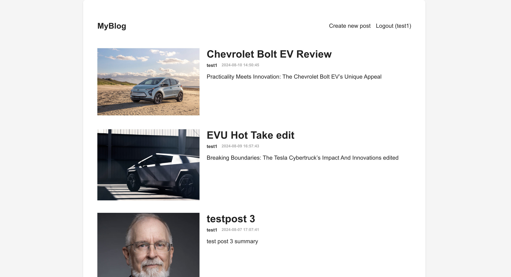

# 📝 MERN Stack Blog Application

A feature-rich blogging platform built with the MERN (MongoDB, Express.js, React, Node.js) stack. This application provides a seamless experience for users to create, read, update, and delete blog posts.

## 🚀 Features

- **User Authentication**: Secure registration and login system
- **JWT-based Authorization**: Protected routes and user-specific actions
- **Create and Manage Posts**: Users can create, edit, and delete their own posts
- **Rich Text Editing**: Integrated React Quill for a powerful writing experience
- **Image Upload**: Support for cover images in blog posts
- **Responsive Design**: Mobile-friendly interface for on-the-go blogging

## 🛠️ Technologies Used

- **Frontend**: 
  - React.js
  - React Router for navigation
  - Axios for API requests
  - React Quill for rich text editing
- **Backend**: 
  - Node.js
  - Express.js
  - MongoDB with Mongoose ORM
- **Authentication**: 
  - JSON Web Tokens (JWT)
  - bcrypt for password hashing
- **File Handling**: 
  - Multer for file uploads

## 🏗️ Project Structure
project-root/
│
├── api/                # Backend
│   ├── models/         # Database models
│   ├── uploads/        # Uploaded files
│   └── index.js        # Main server file
│
└── client/             # Frontend
├── public/
└── src/
├── components/ # React components
├── pages/      # Page components
└── App.js      # Main React component

## 🚦 Getting Started

1. Clone the repository
2. Install dependencies for both frontend and backend
3. Set up your MongoDB database
4. Configure environment variables
5. Run the backend server
6. Start the React development server

Detailed setup instructions can be found in the [Installation Guide](./INSTALL.md).

## 🔐 Environment Variables

Make sure to set up the following environment variables:

- `MONGODB_URI`: Your MongoDB connection string
- `ACCESS_TOKEN_SECRET`: Secret key for JWT

## 🛣️ API Endpoints

- `POST /register`: User registration
- `POST /login`: User login
- `GET /profile`: Get user profile
- `POST /post`: Create a new blog post
- `GET /post`: Retrieve all posts
- `GET /post/:id`: Retrieve a specific post
- `PUT /post`: Update a post
- `DELETE /post/:id`: Delete a post

## 🤝 Contributing

Contributions, issues, and feature requests are welcome!

## 📜 License

This project is [MIT](https://choosealicense.com/licenses/mit/) licensed.

## 👨‍💻 Author

**Your Name**
- Github: [@Kishorekumar](https://github.com/KishorekumarBS)
- LinkedIn: [My LinkedIn](https://www.linkedin.com/in/kishorekumarbs/)

---

⭐️ Star this repo if you like what you see!